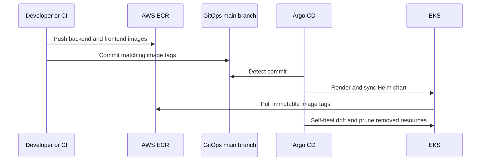

# TaskFlow GitOps

This repository is the deployment source of truth for TaskFlow. Argo CD watches its `main` branch, renders the Helm chart with development values, and reconciles the result into EKS.

## Repository layout

```text
taskflow-gitops/
├── argocd/
│   └── taskflow-dev.yaml   Argo CD Application for development
└── taskflow/
    ├── Chart.yaml
    ├── values.yaml         Shared defaults and infrastructure endpoints
    ├── values-dev.yaml     Development overrides
    ├── values-prod.yaml    Production overrides
    └── templates/          Kubernetes resources rendered by Helm
```

Read [the chart guide](taskflow/README.md) for every value and for local rendering commands.

## How deployment works



Do not deploy application changes with `kubectl edit`. Argo CD has `selfHeal: true`, so it will restore the state committed here.

## Cluster prerequisites

Before applying the Argo CD Application, the environment needs:

- Running EKS nodes with ECR pull access
- Backend and frontend ECR repositories and images
- A reachable PostgreSQL/RDS database with the schema applied
- Argo CD, NGINX Gateway Fabric, Gateway API CRDs, and AWS Load Balancer Controller
- DNS for `ingress.host`, normally pointing to the ALB created by the Ingress

The application Terraform now creates EKS, ECR, RDS, Argo CD, monitoring, Gateway API CRDs, NGINX Gateway Fabric, and AWS Load Balancer Controller. It does not push application images, apply this repository's Argo CD Application, or create DNS records.

The current chart uses Docker Hub repositories even though Terraform creates ECR repositories. Either push the configured Docker Hub images or change `backend.image.repository` and `frontend.image.repository` to the Terraform-created ECR URLs.

## Security required before deployment

`taskflow/values.yaml` currently contains real-looking `DB_PASSWORD` and `JWT_SECRET` values. Treat them as compromised: rotate them, remove them from Git history, and deliver replacements from AWS Secrets Manager through External Secrets or another encrypted secret workflow.

A Kubernetes `Secret` template does not make a plaintext value safe in Git. Base64 encoding would not make it safe either.

## First deployment

1. Connect `kubectl` to the correct EKS cluster and verify it:

   ```bash
   kubectl config current-context
   kubectl get nodes
   ```

2. Verify the required controllers and classes:

   ```bash
   kubectl get pods -n argocd
   kubectl get gatewayclass
   kubectl get ingressclass
   kubectl get pods -n nginx-gateway
   ```

3. Review and render the development release locally:

   ```bash
   helm lint taskflow -f taskflow/values.yaml -f taskflow/values-dev.yaml
   helm template taskflow-dev taskflow \
     --namespace taskflow \
     -f taskflow/values.yaml \
     -f taskflow/values-dev.yaml
   ```

4. Confirm these values before applying:

   - Both ECR repository URLs and tags
   - `DB_HOST`, `DB_NAME`, `DB_USER`, and `DB_SSL`
   - `CLIENT_URL`
   - Gateway and Ingress namespaces, class names, service name, and hostname
   - The secret delivery mechanism

5. Register the app after Terraform has installed Argo CD and the controllers:

   ```bash
   kubectl apply -f argocd/taskflow-dev.yaml
   ```

The Application has `CreateNamespace=true`, so Argo CD creates the `taskflow` namespace. It then uses `values.yaml` followed by `values-dev.yaml`; later files override earlier files.

## Release a new application version

After pushing both images to ECR, edit only the environment tags:

```yaml
# taskflow/values-dev.yaml
backend:
  image:
    tag: "GIT_COMMIT_SHA"

frontend:
  image:
    tag: "GIT_COMMIT_SHA"
```

Use immutable tags, and normally use the same Git commit SHA for both images. Then commit and push:

```bash
git add taskflow/values-dev.yaml
git commit -m "deploy: taskflow GIT_COMMIT_SHA to dev"
git push origin main
```

Argo CD will sync automatically. No manual `helm upgrade` is needed for the Argo-managed release.

## Verify a deployment

```bash
kubectl get applications -n argocd
kubectl get pods,services -n taskflow
kubectl get gateway -n nginx-gateway
kubectl get httproute -n taskflow
kubectl get ingress -n nginx-gateway
kubectl rollout status deployment/taskflow-backend -n taskflow
kubectl rollout status deployment/taskflow-frontend -n taskflow
```

For failures, inspect events and logs:

```bash
kubectl describe application taskflow-dev -n argocd
kubectl get events -n taskflow --sort-by=.lastTimestamp
kubectl logs deployment/taskflow-backend -n taskflow
kubectl logs deployment/taskflow-frontend -n taskflow
```

## Roll back

Git is the rollback mechanism. Revert the commit that changed the image tag or configuration, and push the revert to `main`:

```bash
git log --oneline -- taskflow/values-dev.yaml
git revert COMMIT_SHA
git push origin main
```

Argo CD detects the revert and reconciles the previous desired state.

## Environment changes

| Change | File |
| --- | --- |
| Shared image repository, ports, resources, RDS host, domain, or gateway settings | `taskflow/values.yaml` |
| Development replicas, image tags, or environment name | `taskflow/values-dev.yaml` |
| Production replicas, image tags, or environment name | `taskflow/values-prod.yaml` |
| Kubernetes resource structure | `taskflow/templates/` |
| Git repository URL, branch, values files, or destination namespace | `argocd/taskflow-dev.yaml` |

Prefer a separate Argo CD Application per environment. A production Application should load `values.yaml` and `values-prod.yaml` and should have an explicitly reviewed sync policy.
